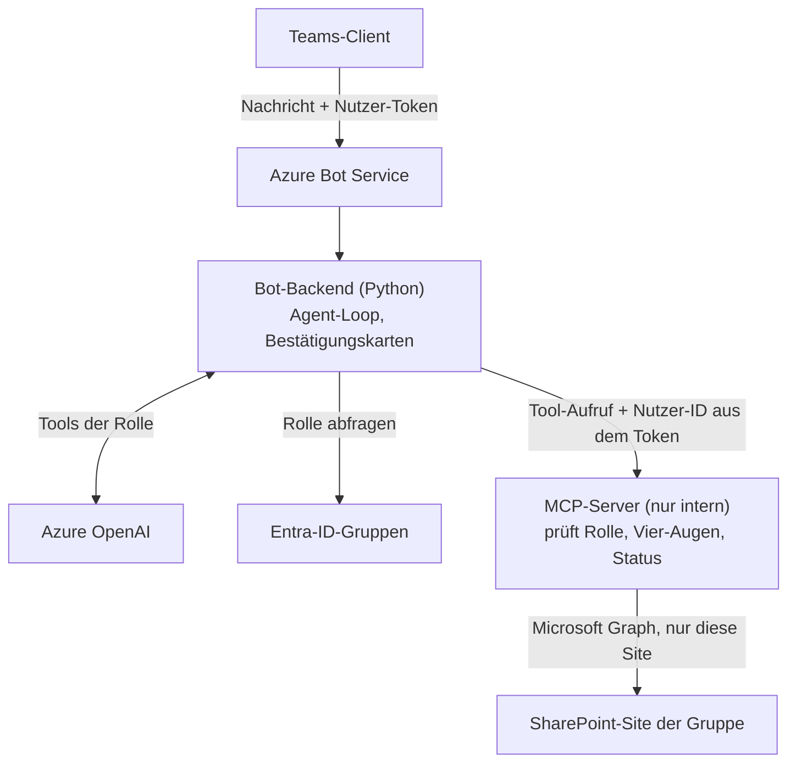

# campus-agent

[](https://github.com/juliankunz18/campus-agent/actions/workflows/ci.yml)
[](LICENSE)

*English version: [README.md](README.md)*

**campus-agent** (Arbeitstitel) ist ein Open-Source-Framework, mit dem gemeinnützige
Hochschulgruppen einen KI-Vereinsassistenten in Microsoft Teams betreiben. Mitglieder
fragen im Chat nach ihren eigenen Daten, beantragen Engagementbescheinigungen, erhalten
Antworten zur Satzung und melden sich zu Veranstaltungen an; der Vorstand prüft und gibt
frei - immer mit einem Menschen in der Schleife.

> **Status: frühe Entwicklung.** Der fachliche Kern (Rollen, Antrags-Workflow,
> Vier-Augen-Prinzip, Tool-Policy, Konfiguration, Modulsystem) ist umgesetzt und
> getestet. Teams, SharePoint und Azure OpenAI sind noch nicht angebunden; diese Adapter
> sind Platzhalter. Bitte nicht mit echten Mitgliederdaten verwenden.

Erster Pilotpartner ist **linkit e.V.**, der das Framework unter der
Open-Source-Lizenz nutzt.

## Prinzipien

1. **Framework zuerst.** Nichts im Kern ist auf eine Gruppe zugeschnitten; jede Gruppe
   ist eine Konfiguration.
2. **Ein Technologiepfad.** Teams, SharePoint und Azure OpenAI im eigenen
   Microsoft-365-Tenant der Gruppe - über Microsoft for Nonprofits günstig erreichbar.
3. **Sicher ohne Zusatzwissen.** Rollenprüfung, Vier-Augen-Prinzip und Bestätigung per
   Karte sind fest eingebaut und nicht abschaltbar.
4. **Erweiterbar über Module.** Neue Funktionen kommen als eigene Pakete dazu; der Kern
   bleibt unverändert.
5. **Deutsch zuerst, Englisch mitgedacht.** Prompts, Karten und Texte sind von Beginn an
   übersetzbar.

## Architektur



* Die **Nutzer-ID stammt aus dem geprüften Teams-Token**, nie aus dem Modell. Kein Tool
  hat einen Parameter für die Nutzer-ID.
* Das Modell sieht nur die **Tools der eigenen Rolle**, und jedes Tool prüft die Rolle
  auf dem Server noch einmal.
* **Verbindliche Aktionen** (`commit`-Tools) laufen nie auf Wunsch des Modells: Der Bot
  zeigt eine Bestätigungskarte und führt die Aktion beim Klick ohne Modell aus.
* Der **MCP-Server** ist die einzige Komponente mit Schreibzugriff auf SharePoint.

Details: [docs/architecture.md](docs/architecture.md) und die
[Architekturentscheidungen](docs/adr/).

### Aufbau des Repositorys

| Pfad | Paket | Inhalt |
|---|---|---|
| `core/` | `campus_agent_core` | Ports, Domäne (Rollen, Anträge, Vier-Augen), Konfiguration, Modulsystem, Agent-Loop |
| `integrations/` | `campus_agent_integrations` | Adapter für Teams, SharePoint/Graph, Azure OpenAI, Table Storage sowie Fakes |
| `modules/members` | `campus_agent_members` | eigene Stammdaten, Änderungsmeldungen, Mitgliederverwaltung |
| `modules/certificates` | `campus_agent_certificates` | Aktivitäten und Engagementbescheinigungen |
| `modules/knowledge` | `campus_agent_knowledge` | Antworten aus Satzung, FAQ, Onboarding, Protokollen |
| `modules/events` | `campus_agent_events` | Veranstaltungen und Anmeldungen |
| `apps/bot` | `campus_agent_bot` | Bot-Backend (aiohttp) |
| `apps/mcp` | `campus_agent_mcp` | MCP-Server (Streamable HTTP) |
| `apps/cli` | `campus_agent_cli` | `campus-agent init / provision / doctor` |
| `examples/musterverein/` | | fiktiver Beispielverein |
| `evals/` | | Evaluierungs-Runner, synthetisches Golden Set, Angriffsfälle |
| `infra/` | | Infrastruktur als Code (geplant) |

## Schnellstart mit dem fiktiven Musterverein

Voraussetzungen: [uv](https://docs.astral.sh/uv/) (installiert Python 3.12 selbst)
und optional Docker.

```bash
git clone https://github.com/juliankunz18/campus-agent.git
cd campus-agent
uv sync
uv run pytest
```

Beispielkonfiguration prüfen und anzeigen, welche SharePoint-Listen angelegt würden:

```bash
uv run campus-agent doctor --config examples/musterverein/campus-agent.yaml --env-file examples/musterverein/.env.example
uv run campus-agent provision --config examples/musterverein/campus-agent.yaml --env-file examples/musterverein/.env.example
```

Bot, MCP-Server und Azurite lokal starten:

```bash
docker compose up --build
```

* Bot-Status: <http://localhost:3978/healthz>
* MCP-Server: `http://localhost:8000/mcp` - die Tools lassen sich mit dem
  [MCP Inspector](https://github.com/modelcontextprotocol/inspector) ansehen.
  Tool-Aufrufe antworten derzeit mit `NOT_IMPLEMENTED`.

Eine eigene Konfiguration beginnt mit `uv run campus-agent init meine-gruppe/`.

## Mitmachen

Beiträge sind willkommen. Jeder Commit braucht einen DCO-Sign-off (`git commit -s`);
Beitragende behalten ihr Urheberrecht, ihre Beiträge stehen unter der Projektlizenz.
Siehe [CONTRIBUTING.md](CONTRIBUTING.md) und den
[Verhaltenskodex](CODE_OF_CONDUCT.md). Sicherheitslücken bitte vertraulich melden, wie
in [SECURITY.md](SECURITY.md) beschrieben.

## Lizenz

Copyright 2026 Julian Kunz und Mitwirkende. Lizenziert unter der
[Apache License 2.0](LICENSE); siehe auch [NOTICE](NOTICE).

Nichts in diesem Projekt, auch keine künftige Datenschutz-Vorlage, ist Rechtsberatung.
