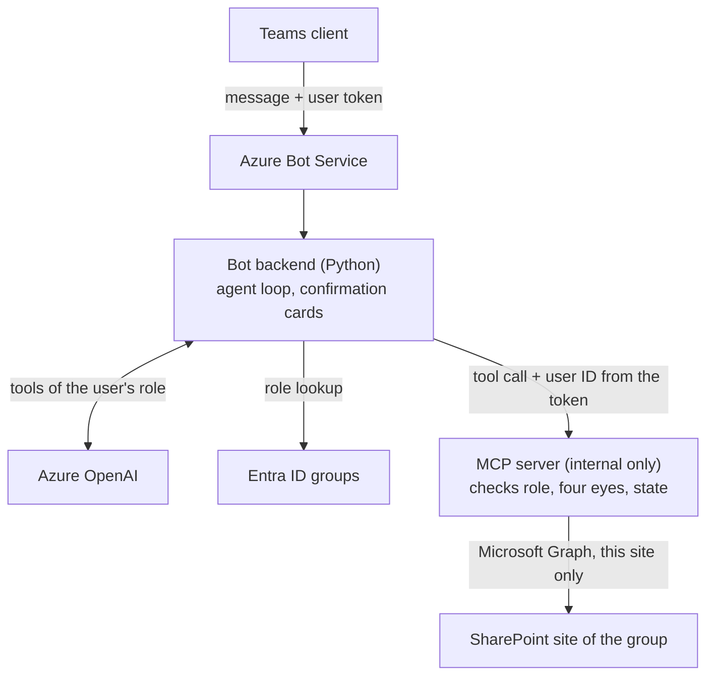

# campus-agent

[](https://github.com/juliankunz18/campus-agent/actions/workflows/ci.yml)
[](LICENSE)

*Deutsche Fassung: [README.de.md](README.de.md)*

**campus-agent** (working title) is an open-source framework that lets non-profit
student groups run an AI assistant for their association in Microsoft Teams. Members
ask in chat for their own data, request engagement certificates, get answers about the
statutes and sign up for events; the board reviews and approves - always with a human
in the loop.

> **Status: early development.** The domain core (roles, application workflow,
> four-eyes principle, tool policy, configuration, module system) is implemented and
> tested. Teams, SharePoint and Azure OpenAI are not connected yet; those adapters are
> stubs. Do not use it with real member data.

The first pilot partner is **linkit e.V.**, which uses the framework under its
open-source license.

## Principles

1. **Framework first.** Nothing in the core is specific to one group; every group is a
   configuration.
2. **One technology path.** Teams, SharePoint and Azure OpenAI in the group's own
   Microsoft 365 tenant - affordable for non-profits through Microsoft for Nonprofits.
3. **Safe without extra knowledge.** Role checks, the four-eyes principle and
   confirmation cards are built in and cannot be switched off.
4. **Extensible through modules.** New features are separate packages; the core stays
   unchanged.
5. **German first, English in mind.** Prompts, cards and texts are translatable from
   day one.

## Architecture



* The **user ID comes from the verified Teams token**, never from the model. No tool
  has a user parameter.
* The model only sees the **tools of the user's role**, and every tool checks the role
  again on the server.
* **Binding actions** (`commit` tools) never run on the model's request: the bot shows
  a confirmation card and executes the action on click, without the model.
* The **MCP server** is the only component with write access to SharePoint.

Details: [docs/architecture.md](docs/architecture.md) and the
[architecture decision records](docs/adr/).

### Repository layout

| Path | Package | Content |
|---|---|---|
| `core/` | `campus_agent_core` | ports, domain (roles, applications, four eyes), config, module system, agent loop |
| `integrations/` | `campus_agent_integrations` | Teams, SharePoint/Graph, Azure OpenAI, Table Storage adapters plus fakes |
| `modules/members` | `campus_agent_members` | own master data, change requests, member administration |
| `modules/certificates` | `campus_agent_certificates` | activities and engagement certificates |
| `modules/knowledge` | `campus_agent_knowledge` | answers from statutes, FAQ, onboarding, minutes |
| `modules/events` | `campus_agent_events` | events and registrations |
| `apps/bot` | `campus_agent_bot` | bot backend (aiohttp) |
| `apps/mcp` | `campus_agent_mcp` | MCP server (Streamable HTTP) |
| `apps/cli` | `campus_agent_cli` | `campus-agent init / provision / doctor` |
| `examples/musterverein/` | | fictional example group |
| `evals/` | | evaluation runner, synthetic golden set, attack cases |
| `infra/` | | infrastructure as code (planned) |

## Quickstart with the fictional Musterverein

Requirements: [uv](https://docs.astral.sh/uv/) (installs Python 3.12 itself) and,
optionally, Docker.

```bash
git clone https://github.com/juliankunz18/campus-agent.git
cd campus-agent
uv sync
uv run pytest
```

Check the example configuration and show which SharePoint lists would be created:

```bash
uv run campus-agent doctor --config examples/musterverein/campus-agent.yaml --env-file examples/musterverein/.env.example
uv run campus-agent provision --config examples/musterverein/campus-agent.yaml --env-file examples/musterverein/.env.example
```

Start bot, MCP server and Azurite locally:

```bash
docker compose up --build
```

* Bot health: <http://localhost:3978/healthz>
* MCP server: `http://localhost:8000/mcp` - inspect the tools with the
  [MCP Inspector](https://github.com/modelcontextprotocol/inspector). Tool calls
  currently return `NOT_IMPLEMENTED`.

Start your own group's configuration with `uv run campus-agent init my-group/`.

## Contributing

Contributions are welcome. Every commit needs a DCO sign-off (`git commit -s`);
contributors keep their copyright and license their contributions under the project
license. See [CONTRIBUTING.md](CONTRIBUTING.md) and the
[Code of Conduct](CODE_OF_CONDUCT.md). Report vulnerabilities privately as described in
[SECURITY.md](SECURITY.md).

## License

Copyright 2026 Julian Kunz and contributors. Licensed under the
[Apache License 2.0](LICENSE); see also [NOTICE](NOTICE).

Nothing in this project, including future privacy templates, is legal advice.
